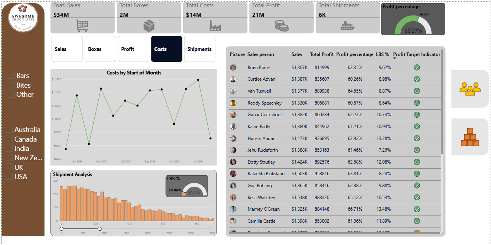

# Chocolate Sales Performance Dashboard

## About the Project

This Power BI dashboard was created using a Chocolate Sales dataset to analyze sales, profit, costs, shipments, and salesperson performance. The dashboard provides a clear view of business performance and helps identify trends across different countries, products, and sales representatives.

The project was built to practice Power BI skills including data cleaning, data modeling, DAX calculations, and dashboard development.

---

## Dashboard Preview



---

## Dataset Information

The dataset includes information such as:

* Sales transactions
* Product categories
* Sales representatives
* Countries
* Shipment details
* Revenue and costs
* Profit and profit percentage

Source file included in the repository:

`sample-chocolate-sales-data-all.xlsx`

---

## Tools and Technologies

* Power BI Desktop
* Power Query
* DAX
* Microsoft Excel
* GitHub

---

## Dashboard Highlights

### KPI Summary

The dashboard provides a quick overview of important business metrics:

| Metric            | Value  |
| ----------------- | ------ |
| Total Sales       | $34M   |
| Total Boxes Sold  | 2M     |
| Total Costs       | $14M   |
| Total Profit      | $21M   |
| Total Shipments   | 6K     |
| Profit Percentage | 60.29% |

### Cost Analysis

Tracks monthly costs and helps understand expense trends over time.

### Shipment Analysis

Shows shipment volume and distribution across the business.

### Salesperson Performance

Compares individual sales representatives based on:

* Total Sales
* Total Profit
* Profit Percentage
* LBS Percentage
* Target Achievement Status

### Country Analysis

Performance can be analyzed across different countries:

* Australia
* Canada
* India
* New Zealand
* United Kingdom
* United States

### Product Analysis

Allows users to explore sales performance across product categories such as:

* Bars
* Bites
* Other Products

---

## Data Preparation

The dataset was cleaned and transformed before creating the dashboard.

Key steps included:

* Checking for missing values
* Validating data types
* Removing inconsistencies
* Creating calculated measures using DAX
* Preparing the data model for reporting

---

## Key Findings

* Total sales reached approximately $34 million.
* The business maintained a profit margin of over 60%.
* Several sales representatives consistently achieved strong profit performance.
* Shipment activity remained steady across the reporting period.
* Country-level analysis revealed differences in sales contribution and profitability.

---

## Skills Applied

Through this project, I practiced:

* Data Cleaning and Transformation
* Data Modeling
* DAX Measure Creation
* KPI Reporting
* Dashboard Design
* Interactive Filtering
* Business Performance Analysis

---

## Repository Structure

```text
Chocolate-Sales-Dashboard/
│
├── sample-chocolate-sales-data-all.xlsx
├── Project1.pbix
├── dashboard.png
└── README.md
```
